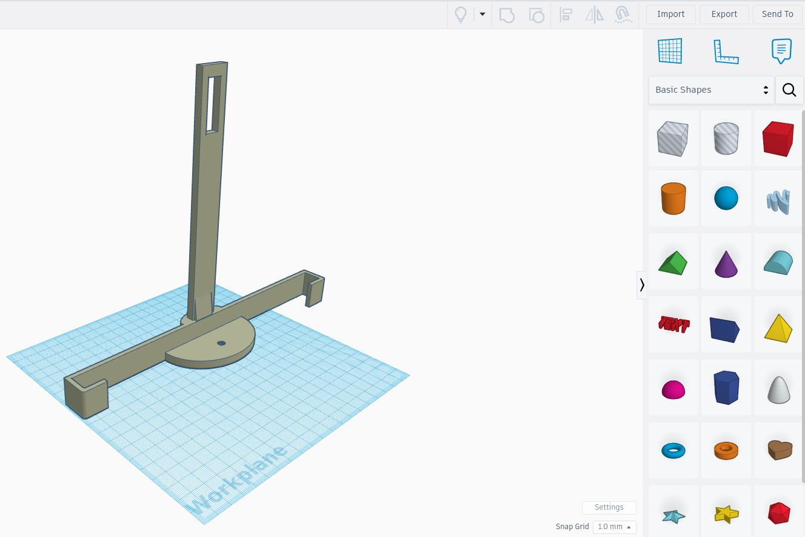
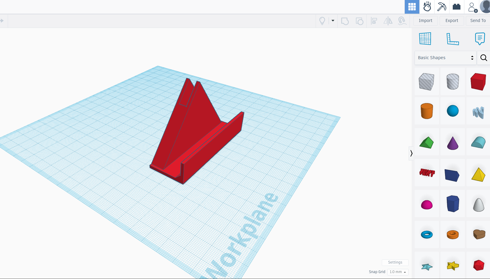
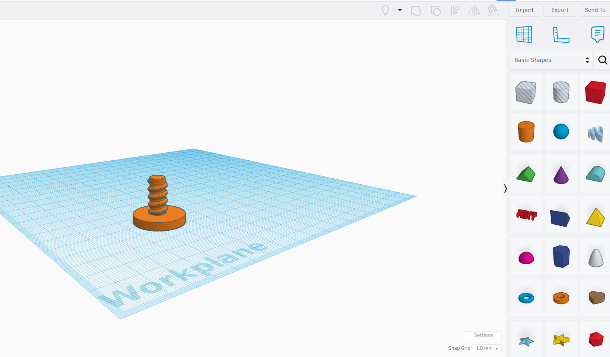
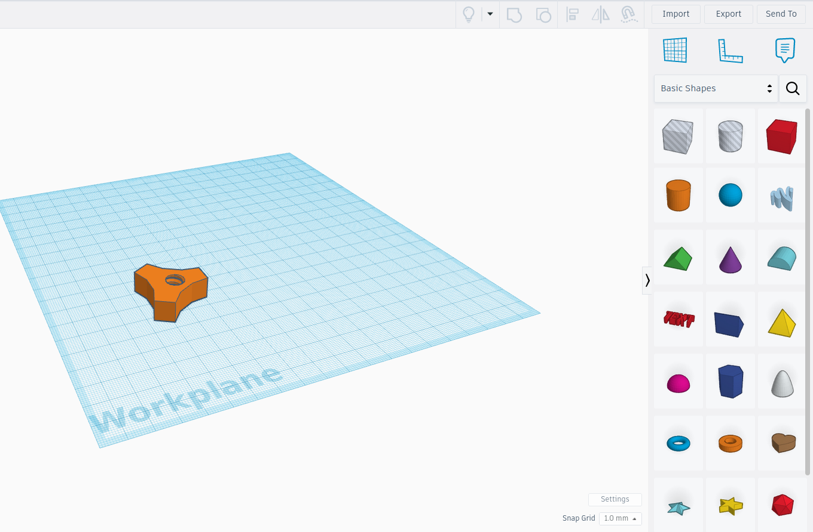

# Βάση ταμπλέτας για τρίποδο
Μπορεί πολλές φορές να χρειαστεί να θέλουμε να φωτογραφήσουμε ή να βιντεοσκοπήσουμε χρησιμοποιώντας μια ταμπλέτα. Χρησιμοποιώντας το τρίποδο που μπορεί να έχουμε ήδη, μπορούμε να εκτυπώσουμε σε 3D printer μια βάση για να τοποθετήσουμε την ταμπλέτα μας με ασφάλεια. 

Η βάση αυτή αποτελείται από τέσσερα κομμάτια, όπως φαίνεται και στις φωτογραφίες που ακολουθούν.
1) Βάση
2) Στήριγμα ασφάλισης
3) Βίδα
4) Παξιμάδι

Η βάση βιδώνει απευθείας πάνω στο τρίποδο, αφού έχουμε φροντίσει το σπείρωμά της να είναι σύμφωνo με το πρότυπο 1/4 20UNC που είναι το σύνηθες πρότυπο σπειρώματος για τις φωτογραφίκές μηχανές / τρίποδα. 

|         Βάση          |        Στήριγμα Ασφάλισης       |
|:----------------------------------:|:------------------------------------:|
|  |  |
|         Βίδα          |            Παξιμάδι             |
|  |  |

Η διάθεση του έργου αυτού γίνεται με άδεια Creative Commons Αναφορά Δημιουργού - Μη Εμπορική Χρήση - Παρόμοια Διανομή 3.0 Ελλάδα (CC BY-NC-SA 3.0 GR).

